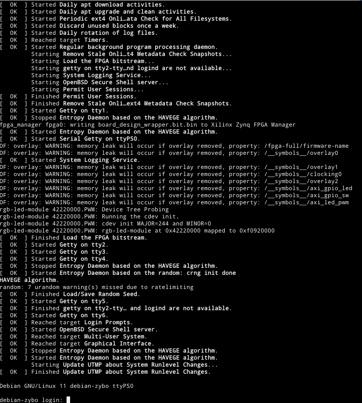
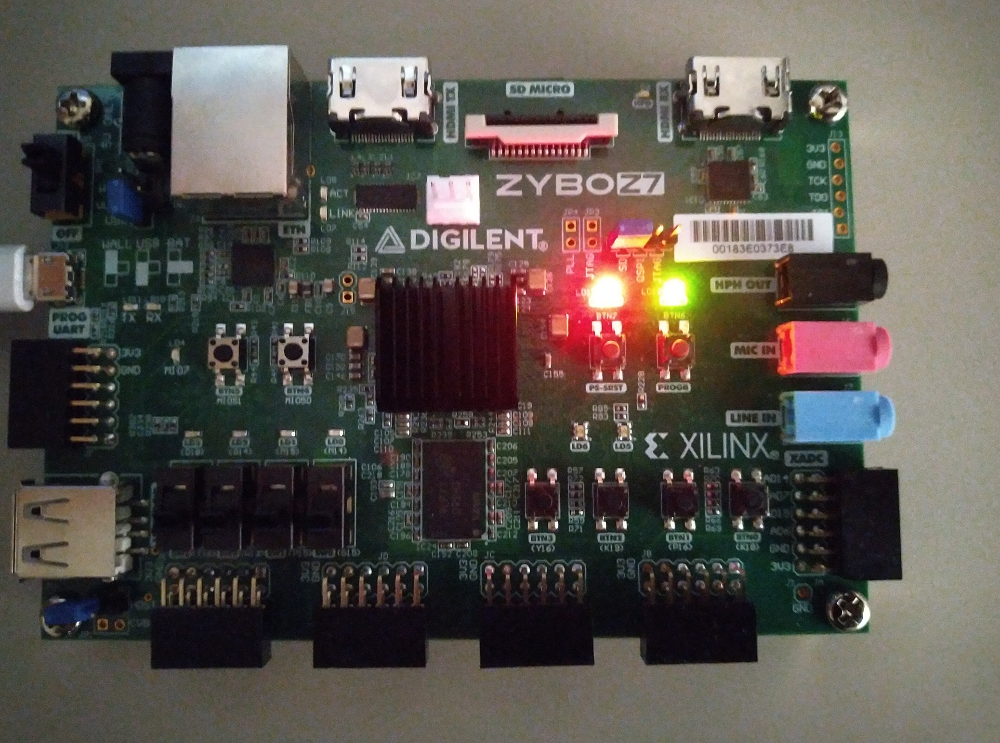

# Build the Debian Image for Zybo

## Required packages and SW

You need to install following packages (my system is Debian Linux, stable):

* Flex
* git
* Bison
* build-essential
* qemu-user-static
* debootstrap
* binfmt-support

You also need to have to cross-compiler tools installed on your system. In my case, I have chosen the toolchain
from Vitis (because it is already there and I have sourced them into PATH; details about Vivado version
is in the root of this repo) but you can also try to install the gcc-arm-linux-gnueabihf package and try the build.

## Time to build Debian image

The package contains a build script `build-image.sh` which takes care of repo download, patching, artefact build
(Linux kernel, uboot, FSBL, images preparations, device tree translation) and so on. Run the following command to
get Debian image (be sure that Vivado (my choice) or Debian cross-compile toolchain is usable from command line - `arm-linux-gnueabihf-`):

```bash
./build-image.sh -t
```

The `-t` options collects all required artefact into `output/tarball` folder - without this, all artifacts will be
in individual project folders and you can take them from there.

You can also inspect available options using the `-h` option.

## SD card preparation

Booting from SD card requires two partitions:

* Boot partition - requires to have FAT32 filesystem, doesn't need to be big (lets say 100MB)
* Root filesystem - the remaining space can be formatted as ext4 (you need to change the fstab configuration in `scripts/bootstrap-debian-image.sh` script)
* Swap partition is not needed but you can set it up if you need :-)

It is time to mount partitions to be ready for the deploy phase - we need to mount root and `boot` into root

```bash
mkdir root_part
mount /dev/mmcblkp2 root_part
mkdir root_part/boot
mount /dev/mmcblkp1 root_part/boot
```

## How to deploy

Seems like you were able to format and mount all partitions :-). The next step is to unpack the rootfs tarball
(from the build stage) into mounted folders. You can check the output using the `ls root_part` you should see the standard folder structure in Linux system.

```bash
tar --preserve-permissions -xzvf output/tarball/debian-bullseye-rootfs-vanilla.tgz -C root_part
```

The next step is to several files from the tarball folder into the `root_part/boot` directory.

* _BOOT.bin_ - boot image with FSBL (First Stage BootLoader) and uboot. The first step in booting is that Zynq
checks the first partition (FAT32 one) and finds the BOOT.bin file. After that, CPU starts the code of FSBL which
is typically uploading bitstream (not our case), initialize peripherals and so on. The last step of FSBL is to run
the uboot image which is just after the FSBL in the binary
* _boot.scr_ - this file contains the uboot script which loads the Linux kernel, ramdisk, device tree and boots all the stuff.
* _zynq-debian.dtb_ - this file contains the description and addresses of all peripheals on zybo board. The file is
used by the Linux kernel.

The last step is to umount the structure and try to boot.

```bash
umount --recursive root_part
```

## Booting

Now is time to insert the SD card into the slot, turn the power on and let fingers crossed. Now, you can connect
to `/dev/ttyUSB1` serial port (baudrate 115200, HW control flow to OFF) like:

```bash
sudo minicom -b115200 -D /dev/ttyUSB1
```

You should see something like on figures - Debian Linux login screen and green LED on which means that bitstream
was successfully configured.




Default passwords and users:

* user: *root*, password: *root*
* user: *fpga*, password: *fpga*

Also notice you are using this on your own risk!

Enjoy!

## References

* <https://xilinx-wiki.atlassian.net/wiki/spaces/A/pages/460653138/Xilinx+Open+Source+Linux>
* <https://www.xilinx.com/html_docs/xilinx2021_1/vitis_doc/>
* <https://ohwr.org/project/soc-course/wikis/Linux-Kernel-Image-and-Modules>
* <https://u-boot.readthedocs.io/en/stable/usage/booti.html>
* <https://github.com/Kampi/Zybo-Linux/blob/master/docs/wiki/Prepare-a-SD-Card.md>
* <https://github.com/Kampi/Zybo-Linux>
* <https://github.com/PyHDI/zynq-linux>
* <https://xilinx-wiki.atlassian.net/wiki/spaces/A/pages/18842223/U-boot>
* <https://github.com/Netgate/meta-ubmc/blob/master/scripts/uEnv.txt-example>
* <https://www.denx.de/wiki/DULG/LinuxKernelArgs>
* <https://xilinx-wiki.atlassian.net/wiki/spaces/A/pages/18841645/Solution+Zynq+PL+Programming+With+FPGA+Manager#SolutionZynqPLProgrammingWithFPGAManager-UsingDeviceTreeOverlay%3A>
